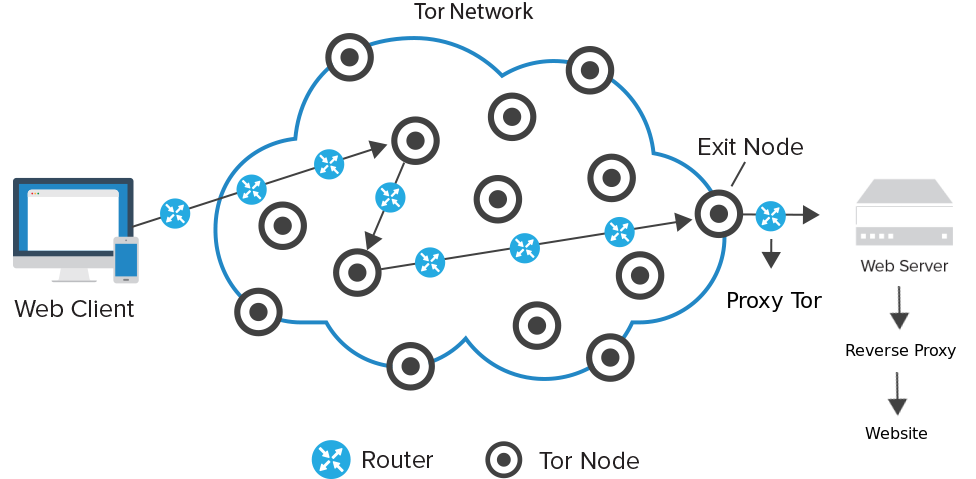
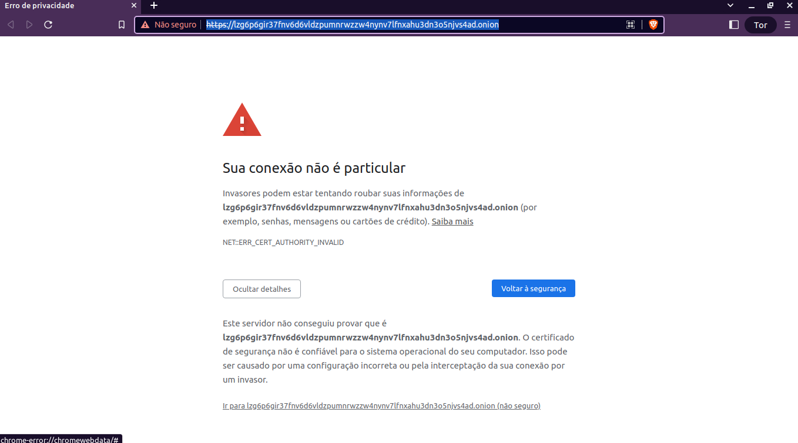
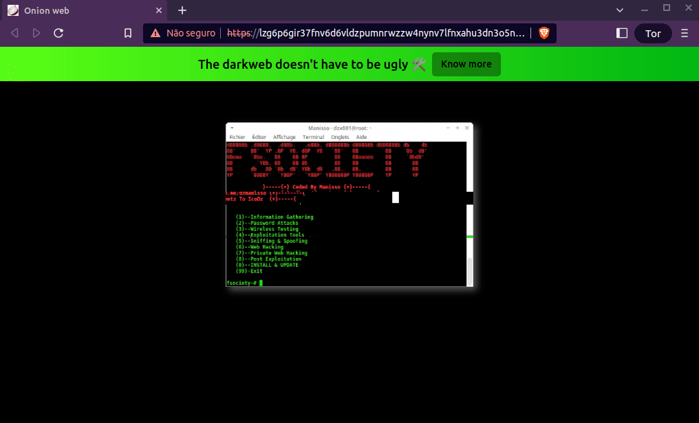

<div align="center">


</div>
<br/>
<br/>

## **💻 Project**

We build a simple web server exposed on the network. So every request that comes from the tor network is redirected to the web server through the [tor proxy](https://community.torproject.org/relay/setup/bridge/debian-ubuntu/).

<p align="center">

</p>

We created three services in the [docker-compose](https://docs.docker.com/compose/) file, the **_tor_**, **_proxy_**, the **_site_** and they all use [Alpine Linux](https://www.alpinelinux.org/) as a base image.

## Get Started

```bash
# up server
docker-compose up --build
```

<p align="center">

</p>

Copy the link generated in yellow, as shown in the figure and paste it into your browser's address bar.
If not, in another instance of the terminal, type the command:

```bash
docker exec -it tor cat /var/lib/tor/hidden_service/hostname
```

I advise [Brave](https://brave.com/pt-br/) as it has access to the tor network by default. Then it will say that the SSL certificate is not secure because it was created by the script. Click go to:

<p align="center">

</p>

After loading the page:

<p align="center">

</p>

To remove containers:

```bash
docker rm -f $(docker-compose ps -aq)
```

## **💥 Considerations**

With the advancement of technology, a lot of information is generated, but very little is said about the privacy of this information. Silicon Valley giants collect your social media data, browsing cookies all the time to profile your internet behavior. They use it to sell products, suggest content, and more. If everyone knew what the Tor project is, I'm sure many would use it and the browsing speed would be better as there would be more nodes. In the same way that the ordinary internet can be used for evil, as companies, governments and people do, so can the Tor network. I will not delve into this ethical discourse. As Jesus said: There is nothing outside man that can defile him; but what comes out of him what defiles.

## **👨‍🚀 Author**

<a href="https://github.com/tpaphysics">

  <br />
  <sub>
    <b>Thiago Pacheco de Andrade</b>
  </sub>
</a>
<br />

👋 My contacts!

[](https://www.linkedin.com/in/thiago-pacheco-200a1a86/)
[](mailto:physics.posgrad.@gmail.com)

## **📝 License**

This project has an MIT [license](LICENSE.md).
